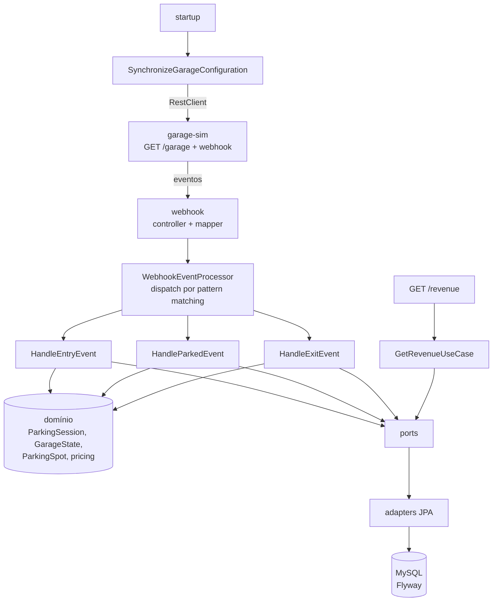
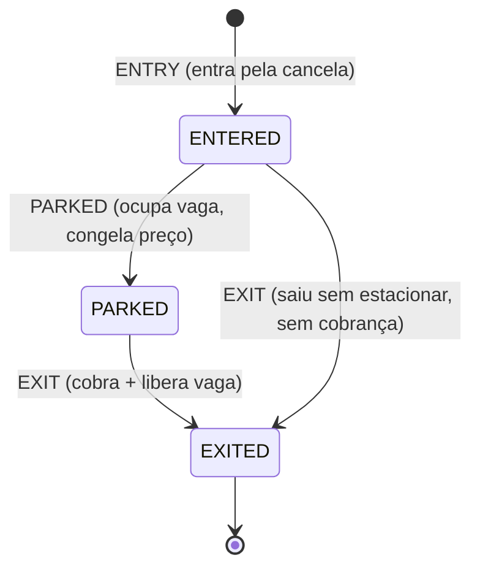
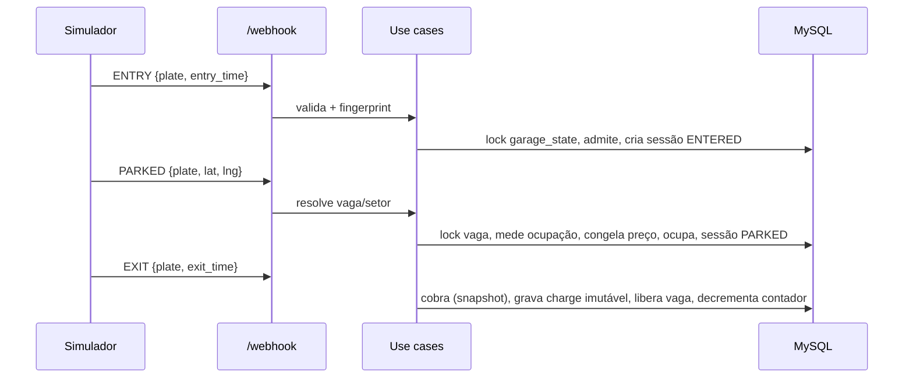
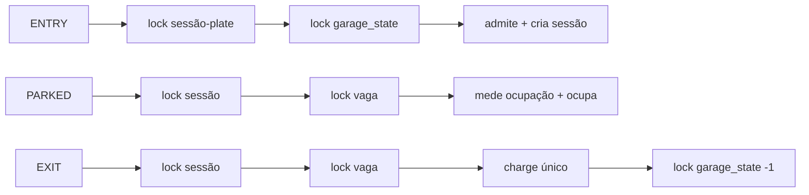

# Estapar — Parking Lot Service

Backend de gerenciamento de estacionamento para o **Estapar Backend Developer Test (V1.4)**.
Consome os eventos `ENTRY` / `PARKED` / `EXIT` do simulador, aplica **preço dinâmico por
ocupação** e **cobrança por tempo**, e expõe a **receita por setor e data**.

> Código, testes e commits em inglês; esta documentação em português para o time.

Java 21 · Spring Boot 3.5 · MySQL 8 · Flyway · Testcontainers · Docker.
**139 testes** (unitários + integração com MySQL real + concorrência + e2e) verdes via
`./mvnw clean verify`.

---

## Índice

1. [Visão geral](#1-visão-geral) · 2. [Requisitos do desafio](#2-requisitos-do-desafio) ·
3. [Arquitetura](#3-arquitetura) · 4. [Por que um monólito modular](#4-por-que-um-monólito-modular) ·
5. [Modelo de domínio](#5-modelo-de-domínio) · 6. [Fluxo de eventos](#6-fluxo-de-eventos) ·
7. [ENTRY, PARKED e EXIT](#7-como-entry-parked-e-exit-são-interpretados) ·
8. [Preço dinâmico](#8-preço-dinâmico) · 9. [Regra de cobrança](#9-regra-de-cobrança) ·
10. [Modelo de dados](#10-modelo-de-dados) · 11. [Concorrência](#11-estratégia-de-concorrência) ·
12. [Idempotência](#12-estratégia-de-idempotência) · 13. [Tratamento de erros](#13-tratamento-de-erros) ·
14. [Segurança](#14-considerações-de-segurança) · 15. [Logs e observabilidade](#15-logs-e-observabilidade) ·
16. [Como executar](#16-como-executar) · 17. [Simulador](#17-como-rodar-o-simulador) ·
18. [Como testar](#18-como-testar) · 19. [Postman](#19-postman-collection) · 20. [OpenAPI](#20-openapi) ·
21. [Premissas](#21-premissas) · 22. [Trade-offs](#22-trade-offs) ·
23. [Limitações conhecidas](#23-limitações-conhecidas) · 24. [Evolução em produção](#24-evolução-em-produção)

---

## 1. Visão geral

A garagem tem **um único grupo de cancelas** na entrada; os **setores são divisões lógicas**
(não físicas). O serviço:

- sincroniza setores e vagas a partir do simulador (`GET /garage`) no startup;
- recebe eventos no webhook `POST /webhook`;
- calcula o preço na hora em que o veículo estaciona (primeiro momento em que o setor é
  conhecido) e cobra na saída pelo tempo de permanência;
- responde `GET /revenue?date=&sector=` com a receita agregada de cobranças imutáveis.

## 2. Requisitos do desafio

| Requisito | Onde está |
|---|---|
| Java 21 + Spring + MySQL + git | `pom.xml`, este repositório |
| Buscar/armazenar config da garagem no startup | [`SynchronizeGarageConfigurationUseCase`](src/main/java/com/estapar/garage/garageconfiguration/application/SynchronizeGarageConfigurationUseCase.java) |
| Webhook `ENTRY`/`PARKED`/`EXIT` (HTTP 200) | [`WebhookController`](src/main/java/com/estapar/garage/webhook/infrastructure/inbound/web/WebhookController.java) |
| `GET /revenue` por setor e data | [`RevenueController`](src/main/java/com/estapar/garage/revenue/infrastructure/inbound/web/RevenueController.java) |
| 30 min grátis, depois tarifa/hora arredondada p/ cima | [`BillingCalculator`](src/main/java/com/estapar/garage/pricing/domain/BillingCalculator.java) |
| Preço dinâmico por lotação (−10/0/+10/+25%) | [`TieredOccupancyPricingPolicy`](src/main/java/com/estapar/garage/pricing/domain/TieredOccupancyPricingPolicy.java) |
| Garagem/setor cheios bloqueiam entrada | [`GarageState`](src/main/java/com/estapar/garage/parking/domain/GarageState.java), [`HandleParkedEventUseCase`](src/main/java/com/estapar/garage/parking/application/HandleParkedEventUseCase.java) |

A análise completa do desafio e do simulador (com evidências capturadas ao vivo) está em
[`docs/specs/00-challenge-analysis.md`](docs/specs/00-challenge-analysis.md).

## 3. Arquitetura

Monólito modular hexagonal: uma aplicação Spring Boot, um MySQL. Cada módulo tem
`domain` (regras puras) / `application` (casos de uso) / `infrastructure` (adapters
inbound/outbound). Dependências apontam para dentro; fronteiras validadas por **ArchUnit**.



Módulos: `garageconfiguration`, `parking`, `pricing`, `revenue`, `webhook`, `shared`.
Casos de uso principais: `SynchronizeGarageConfigurationUseCase`, `HandleEntryEventUseCase`,
`HandleParkedEventUseCase`, `HandleExitEventUseCase`, `GetRevenueUseCase`.

## 4. Por que um monólito modular

Os invariantes mais fortes (capacidade global, ocupação de vaga, cobrança única) vivem numa
**única transação ACID**. Microserviços exigiriam saga/transação distribuída para um problema
que um `@Transactional` resolve. Kafka/Redis/CQRS não agregam nada nesta escala (um simulador,
30 vagas). Os módulos preservam a separação lógica e deixam uma decomposição futura mecânica.
Detalhes em [ADR-001](docs/adr/ADR-001-modular-monolith.md).

## 5. Modelo de domínio



`ParkingSession` é o agregado central e só muda por comportamento (`enter`, `parkAt`, `exitAt`),
nunca por setters. Value objects: `LicensePlate`, `Coordinates`, `Money` (BRL, `BigDecimal`
escala 2), `OccupancyRate`, `AppliedPrice`. Detalhe em
[`docs/specs/01-domain-model.md`](docs/specs/01-domain-model.md).

## 6. Fluxo de eventos



## 7. Como ENTRY, PARKED e EXIT são interpretados

O documento pede preço dinâmico "na entrada", mas o evento `ENTRY` **não informa setor nem
vaga** (verificado no simulador real — só placa + `entry_time`). O setor só é conhecível no
`PARKED`, pelas coordenadas. Decisão explícita ([ADR-002](docs/adr/ADR-002-entry-parked-interpretation.md)):

1. `ENTRY` = entrada física pela cancela → cria sessão `ENTERED` e consome **capacidade global**.
2. `PARKED` = primeiro instante tecnicamente possível para aplicar a política do setor →
   mede a ocupação **antes** de ocupar a vaga, **congela** base/ocupação/multiplicador/preço.
3. `EXIT` cobra pelo snapshot congelado; nunca recalcula com a ocupação atual.
4. `ENTERED → EXITED` (saiu sem estacionar) fecha a sessão **sem cobrança** (não há setor/preço).

Uma alternativa seria o `ENTRY` incluir `sector`/`spotId` — recomendada como evolução do
contrato, mas fora do controle deste teste.

## 8. Preço dinâmico

Multiplicador sobre a ocupação do setor, medida **antes** do novo veículo (spec 02 R3):

| Ocupação | Multiplicador |
|---|---|
| `0% ≤ o < 25%` | ×0,90 |
| `25% ≤ o < 50%` | ×1,00 |
| `50% ≤ o < 75%` | ×1,10 |
| `75% ≤ o < 100%` | ×1,25 |
| `o ≥ 100%` | setor fechado (`SectorFullException`) |

Decisão de banda em **aritmética inteira** (`occupied·100 < capacity·percent`) para nenhum
arredondamento cruzar a fronteira. Tudo em `BigDecimal`; `double`/`float` proibidos.

## 9. Regra de cobrança

```
duração ≤ 30min → grátis (R$ 0,00)
duração > 30min → cobrar a duração TOTAL, arredondada p/ cima: billableHours = ceil(duração / 1h)
```

`30:00 → 0h · 30:01 → 1h · 60:00 → 1h · 60:01 → 2h · 120:01 → 3h`. Precisão de segundos,
`Instant`/`Duration`, `Clock` injetado (domínio nunca chama `Instant.now()`). `amount =
billableHours × preço_horário_congelado`.

## 10. Modelo de dados

Flyway é a **única** fonte do schema (`ddl-auto=validate`). Tabelas: `sector`, `parking_spot`,
`garage_state` (linha única de capacidade global), `parking_session`, `parking_charge`
(imutável, `UNIQUE(session_id)`), `processed_webhook_event` (`UNIQUE(fingerprint)`).
Coordenadas em `DECIMAL(9,6)`. `parking_session.active_plate` espelha a placa enquanto ativa e
vira `NULL` na saída — idioma MySQL para "uma sessão ativa por placa" (UNIQUE ignora NULLs).
Migrations em [`src/main/resources/db/migration`](src/main/resources/db/migration);
detalhe em [`docs/specs/04-data-model.md`](docs/specs/04-data-model.md).

## 11. Estratégia de concorrência

**Locking pessimista** (`SELECT … FOR UPDATE`) nos recursos que carregam invariantes, com
**ordem global de locks** `fingerprint → parking_session → parking_spot → garage_state` para
evitar deadlocks ([ADR-003](docs/adr/ADR-003-locking-strategy.md)):



Transações curtas, sem HTTP dentro (o simulador só é chamado no startup). `@Version` como
backstop; unique constraints como última linha de defesa. Cenários provados com
`ExecutorService`+`CountDownLatch` contra MySQL real: última vaga global, mesma vaga, EXIT
duplicado, evento duplicado concorrente. `synchronized` não resolveria em múltiplas instâncias
— o banco é o ponto de serialização.

## 12. Estratégia de idempotência

Eventos **não têm id** (verificado). Fingerprint SHA-256 canônico
([ADR-004](docs/adr/ADR-004-webhook-idempotency.md)):

```
ENTRY  = SHA256("ENTRY|"  + placa + "|" + entryTimeUTC)
PARKED = SHA256("PARKED|" + placa + "|" + lat6 + "|" + lng6)
EXIT   = SHA256("EXIT|"   + placa + "|" + exitTimeUTC)
```

Registrado **na mesma transação** do efeito. Replay exato → 200 `DUPLICATE`, zero efeito
colateral; concorrente → segundo INSERT bloqueia no índice único → tratado como duplicado.
Um `ENTRY` novo (outro `entry_time`) para placa ativa é fingerprint diferente → 409 pela regra
de domínio, não duplicado.

## 13. Tratamento de erros

RFC-7807 `ProblemDetail` (`application/problem+json`) via `@RestControllerAdvice`, com
`type`/`title`/`status`/`detail`/`instance` + `correlationId`. **Nunca** vaza stack trace
(`server.error.include-stacktrace=never`).

| Situação | HTTP |
|---|---|
| Processado / duplicado exato | 200 |
| Payload inválido, evento desconhecido, data inválida | 400 |
| Vaga/sessão/setor inexistente | 404 |
| Garagem/setor cheio, vaga ocupada, sessão já ativa, transição inválida, cobrança duplicada | 409 |
| Configuração não sincronizada | 503 |
| Falha inesperada | 500 (sem stack trace) |

## 14. Considerações de segurança

Segurança **proporcional**: o simulador não fornece credenciais, então autenticação quebraria
o contrato. Implementado: validação estrita (enum fechado, regras condicionais por tipo, placa
`[A-Z0-9-]{1,16}`, faixa de coordenadas), credenciais só por env (`.env.example`, `.env` no
`.gitignore`, zero segredo no git), Actuator restrito a `health`/`info`/`metrics`, sem CORS
aberto, sem stack trace, correlation id sanitizado (anti log-injection), placa **mascarada** em
log (`WDE***75`). Evoluções documentadas (não implementadas): mTLS/HMAC no webhook, OAuth2,
rate limiting/WAF, secrets manager.

## 15. Logs e observabilidade

Logs de linha única, parametrizados (nunca concatenação), com nomes estáveis
(`webhook_event_received`, `vehicle_parked`, `parking_charge_created`, `garage_full`, …) e
`correlationId` no MDC. Placa mascarada; `sessionId` preferido. Níveis: INFO fluxo normal,
WARN rejeição de negócio/duplicidade, ERROR falha técnica.

Métricas Micrometer (cardinalidade limitada — sem placa/sessão/coordenada nas tags):
`garage_webhook_events_total{type,result}`, `garage_webhook_rejections_total{type,reason}`,
`garage_event_processing_duration{type}`, `garage_duplicate_events_total{type}`,
`garage_concurrency_conflicts_total{resource}`, `garage_configuration_sync_failures_total`,
gauge `garage_active_sessions`. Readiness fica **DOWN** até a configuração sincronizar.

## 16. Como executar

Pré-requisitos: Docker. (Para rodar os testes/local sem container: JDK 21.)

```bash
# 1) Sobe app (:3003) + MySQL (:3306) com healthcheck e Flyway
docker compose up --build
```

Verificar saúde:

```bash
curl http://localhost:3003/actuator/health
curl http://localhost:3003/actuator/health/readiness   # UP após sincronizar a garagem
```

Rodar sem Docker (precisa de um MySQL e das envs de `.env.example`):

```bash
./mvnw spring-boot:run
```

## 17. Como rodar o simulador

O simulador escuta na porta **3000** (a imagem declara 8080, mas nada escuta lá — ver
`docs/specs/00`). Ele só começa a emitir eventos **depois** que alguém chama `GET /garage` — o
próprio app faz isso no startup.

```bash
# Linux (como no documento): localhost do container == host
docker run -d --network="host" cfontes0estapar/garage-sim:1.0.0

# Windows/macOS (Docker Desktop): publica 3000 e aponta o webhook para o host
docker run -d -p 3000:3000 \
  -e CLIENT_WEBHOOK_URL=http://host.docker.internal:3003/webhook \
  cfontes0estapar/garage-sim:1.0.0
```

Ou tudo na mesma rede do compose (qualquer SO), sem host networking:

```bash
docker compose --profile simulator up --build
```

Smoke test end-to-end contra o simulador real:
[`scripts/smoke-simulator.sh`](scripts/smoke-simulator.sh) (Linux/macOS) ·
[`scripts/smoke-simulator.ps1`](scripts/smoke-simulator.ps1) (Windows).

## 18. Como testar

```bash
./mvnw clean verify   # formatter + unitários + integração (Testcontainers MySQL) + ArchUnit + package
./mvnw test           # só unitários (rápido, sem Docker)
```

Pirâmide: muitos unitários (domínio/preço/cobrança, sem I/O), integração com **MySQL real**
(Testcontainers — nunca H2), concorrência determinística, e dois e2e (cobrado + grátis).
Estratégia completa em [`docs/specs/06-testing-strategy.md`](docs/specs/06-testing-strategy.md).

## 19. Postman Collection

Em [`requests/`](requests): `Estapar-Garage.postman_collection.json` +
`local.postman_environment.json`. Importe os dois, selecione o environment **local**. A pasta
`01 - Simulator` salva `sector`/`spotLat`/`spotLng`/`basePrice` automaticamente. As pastas
cobrem happy path, grátis, validação (400), idempotência (200/DUPLICATE) e conflitos (404/409),
com testes de status, `currency == BRL`, presença de `amount`/`timestamp` e correlation id.
Também há [`requests/garage-api.http`](requests/garage-api.http) para o IntelliJ.

## 20. OpenAPI

springdoc habilitado: **Swagger UI** em `http://localhost:3003/swagger-ui.html`, spec em
`http://localhost:3003/v3/api-docs`. Nenhuma entidade JPA é exposta no contrato — apenas DTOs.

## 21. Premissas

- Timestamps sem fuso do simulador (`2026-07-13T16:02:11`) são **UTC** (ADR-005); armazenamento
  em UTC, zona de negócio `America/Sao_Paulo` configurável.
- `GET /revenue` usa **query params** (`?date=&sector=`), não GET-com-corpo — contrato REST
  canônico; o corpo-em-GET do documento não é suportado de forma confiável.
- Campos extras do `/garage` (`open_hour`, `close_hour`, `duration_limit_minutes`, `occupied`)
  são lidos com leniência e ignorados (fora do escopo funcional).
- `max_capacity` do setor governa o gate de 100%; a ocupação usa a contagem de vagas ocupadas.

## 22. Trade-offs

- **Pessimista vs otimista:** contenção no gate único é esperada; locking pessimista evita
  tempestade de retries. Custo: serialização do `garage_state` (irrelevante nesta escala).
- **Preço no PARKED:** desvio inevitável do "na entrada" — documentado, com snapshot para
  reprodutibilidade.
- **Fingerprint por payload:** simples e robusto; um evento semanticamente igual com timestamp
  diferente é tratado como novo (invariantes de domínio ainda protegem o estado).

## 23. Limitações conhecidas

- `processed_webhook_event` cresce sem TTL (arquivamento = evolução de produção).
- Sem teste de carga/mutação; simulador real não roda na CI (há smoke script local).
- Uma corrida ENTRY/EXIT para a **mesma placa** ao mesmo tempo pode gerar deadlock InnoDB
  (raríssimo, resolvido pela detecção do InnoDB → 503/retry).

## 24. Evolução em produção

mTLS ou HMAC no webhook · OAuth2 client-credentials na API de consulta · rate limiting/WAF ·
restrição de rede · secrets manager · arquivamento/particionamento de `processed_webhook_event`
e `parking_charge` · métricas para Prometheus/Grafana. Nada disso é necessário para o teste.

---

### Documentação de apoio

- Specs: [`docs/specs/`](docs/specs) (00 análise · 01 domínio · 02 regras · 03 API · 04 dados ·
  05 concorrência/idempotência · 06 testes · 07 segurança/observabilidade · 08 aceite)
- ADRs: [`docs/adr/`](docs/adr) (001 monólito · 002 ENTRY×PARKED · 003 locking · 004 idempotência ·
  005 receita/timezone)
- Plano e handoff: [`PLAN.md`](PLAN.md) · [`HANDOFF.md`](HANDOFF.md)
